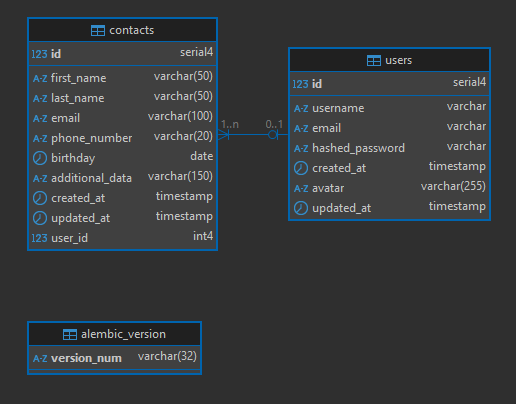

# Зберігання та управління контактами

## Клонуємо попередню версію

Встановимо залежності

```shell
poetry install
```

src\database\models.py

- додаємо клас User
- і залежність user в клас Contact
- якщо ми створили нову базу даних - спочатку застосуємо готові міграції
  ```shell
  alembic upgrade head
  ```
- створюємо міграцію наступною консольною командою в корені проєкту:
  ```Shell
  alembic revision --autogenerate -m 'add user'
  ```
  > Саме оточення alembic ініціалізовано в попередньому проекті
  > Ініціалізуємо оточення `alembic` з підтримкою асинхронності `-t async`
  >
  > ```shell
  > alembic init -t async alembic
  > ```
- Якщо файл з міграцією успішно створився в директорії migrations/versions, то застосуємо створену міграцію:
  ```shell
  alembic upgrade head
  ```
- перевіримо що поля і таблиця User створені:  
  

- створюємо схему валідації для users  
  [src/schemas/users.py](src/schemas/users.py)

- створюємо репозиторій для users
  [src/repository/users.py](src/repository/users.py)

## Сервіс автентифікації та користувача

Для правильної роботи нашого сервісу необхідно встановити наступні пакети:

```shell
    poetry add python-jose["cryptography"]
    poetry add passlib["bcrypt"]
```

- додаємо параметри `jwt` в [src/conf/config.py](src/conf/config.py)
- додаємо код сервісу [src/services/users.py](src/services/users.py)
- додаємо код сервісу [src/services/auth.py](src/services/auth.py)

## Маршрути автентифікації та користувача

- Створимо маршрути [src/api/auth.py](src/api/auth.py) та додамо:
  - `/api/auth/register` — маршрут для реєстрації користувача;
  - `/api/auth/login` — маршрут для входу користувача;
- підключити нові роутери у головному файлі застосунку `main.py`

## Додаємо авторизацію

- У модель User необхідно додати поле `confirmed = Column(Boolean, default=False)`. Це логічний вираз, що визначає, чи був підтверджений email користувача.
- Після цього необхідно виконати міграції для зміни таблиці користувача.
  ```shell
  alembic revision --autogenerate -m 'add to model User filed confirmed'
  ```
- Та застосувати їх.

  ```shell
  alembic upgrade head
  ```

- додамо в репозиторій [src/repository/contacts.py](src/repository/contacts.py) додатковий параметр user: User. Це дозволяє нам виконувати операції в контексті автентифікованого користувача. У кожному методі ми оновили SQLAlchemy-запити, щоб вони враховували контекст користувача. Це гарантує, що користувачі можуть взаємодіяти лише зі своїми конатктами.

[src/services/email.py](src/services/email.py)

-
